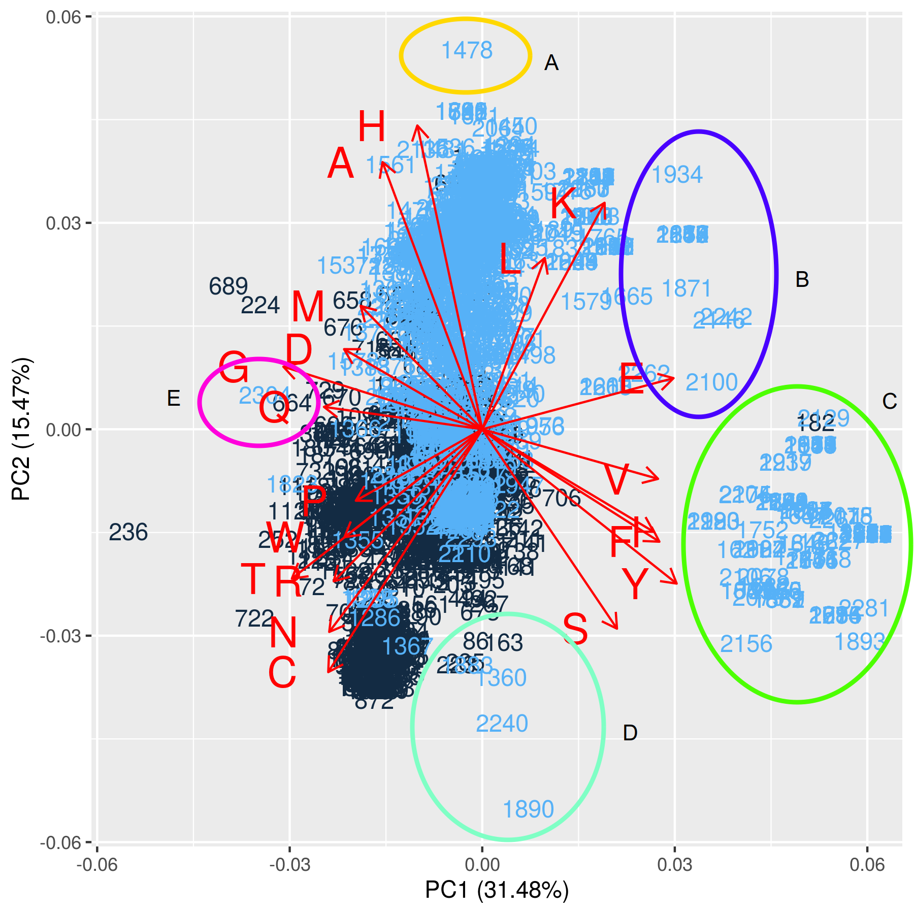

---
output:
    pdf_document: default
#html_document: default
---

# Principle Component Analysis of Myoglobin/Control Protein Sets

## Introduction

This chapter describes the use and functional understanding of Principle Component Analysis (PCA). PCA is very popular and commonly used during the early phases of model development to provide information on variance. In particular, PCA is a transformative process that orders and maximizes variances found within a dataset.

>The primary goal of principal components analysis is to reveal the hidden structure in a dataset. In so doing, we may be able to [^31]
>
>1. identify how different variables work together to create the dynamics of the system
>
>2. reduce the dimensionality of the data
>
>3. decrease redundancy in the data
>
>4. filter some of the noise in the data
>
>5. compress the data
>
>6. prepare the data for further analysis using other techniques

[^31]:Emily Mankin, Principal Components Analysis: A How-To Manual for R, http://people.tamu.edu/~alawing/materials/ESSM689/pca.pdf

---

Several advantages of using PCA should be considered.

1. PCA preserves the global structure among the data points.

2. It is efficiently applied to large data sets.

3. PCA may provide information on the importance of features found in the original datasets.

While disadvantages include:

1. PCA can easily suffer from scale complications. 

2. Similarly to the point above, PCA is susceptible to significant outliers. If the number of samples is small or when values have many potential outliers, this can influence scaling and relative point placement.

3. Intuitive understanding can be tricky.

### Finding the Covariance Matrix

The first step for calculating PCA is to determine the Covariance matrix. Covariance provides a measure of how strongly variables change together.[^32] [^33]

[^32]:http://mathworld.wolfram.com/Covariance.html

[^33]:Trevor Hastie, Robert Tibshirani, Jerome Friedman, 'The Elements of Statistical Learning; Data Mining, Inference, and Prediction,' Second Edition, Springer, DOI:10.1007/978-0-387-84858-7, 2009

### Covariance of two variables {-}

Remember, this simplified formula is to determine covariance for a two-dimensional system. Where $N$ is the number of observations, $\bar x$ is the mean of the independent variable, $\bar y$ is the mean of the dependent variable.

$$cov(x, y) ~=~ \frac{1}{N} \sum_{i=1}^N (x_i - \bar x) (y_i - \bar y)$$

### Covariance of matrices {-}

When dealing with a more significant number of variables one needs to Determine the covariance of matrices, $\large M$ using linear algebra notation is [^34]

[^34]:http://mathworld.wolfram.com/Covariance.html

1. Find the column means of the matrix, $M_{means}$.
2. Find the difference matrix, $D ~=~ M - M_{means}$.
3. Finally calculate the covariance matrix:

$$cov ~ (M) ~=~ \frac{1}{N-1} ~ D^T ~ D, ~~~ where ~~~ D = M - M_{means}$$

Where $D^T$ is the transpose of the difference matrix, $N$ is the number of observations or rows in this case.

### Finding PCA via singular value decomposition

The procedure below is an outline, not the full computation of PCA. 

For more information on Eigenvalues, Eigenvectors and Eigen decomposition I suggest:

1. [CodeEmporium](https://youtu.be/9oSkUej63yk)

2. [Victor Lavrenko](https://youtu.be/IbE0tbjy6JQ)

This procedure for PCA relies on the fact that it is similar to the singular value decomposition (SVD) used when determining eigenvectors and eigenvalues. [^35]

>Singular value decomposition says that every n x p matrix can be written as the product of three matrices: $A = U \Sigma V^T$ where:
>
>1. $U$ is an orthogonal n x n matrix.
>2. $\Sigma$ is a diagonal n x p matrix. In practice, the diagonal elements are ordered so that $\Sigma_{ii} ~\geqq~ \Sigma_{jj}$ for all i < j.
>3. $V$ is an orthogonal p x p matrix, and $V^T$ represents a matrix transpose.
>
>The SVD represents the essential geometry of a linear transformation. It tells us that every linear transformation is a composition of three fundamental actions. Reading the equation from right to left:
>
>1. The matrix $V$ represents a rotation or reflection of vectors in the p-dimensional domain.
>2. The matrix $\Sigma$ represents a linear dilation or contraction along each of the p coordinate directions. If n $\neq$ p, this step also canonically embeds (or projects) the p-dimensional domain into (or onto) the n-dimensional range.
>3. The matrix $U$ represents a rotation or reflection of vectors in the n-dimensional range.

[^35]:https://blogs.sas.com/content/iml/2017/08/28/singular-value-decomposition-svd-sas.html

The intuition for understanding PCA is reasonably straightforward. Consider the 2-dimensional data cloud of points or observations in a hypothetical experiment, as seen in the figure on the left. Variances along both the x and y dimensions are calculated. However, given the data shown, there is a rotation of that x-y plane, which will present the data showing its most significant variance. This variance will reside on an axis analogous to points on an Ordinary Least Squares (OLS) line. This axis is called the *first principle component* followed by the second principal component and so on. 

Unlike an OLS calculation, PCA will determine not only the first and most significant variance of your data set, but it will, through the rotation and transform your dataset via linear algebra, calculating N variances within your dataset, where N is equal to the number of features in the dataset. The second principal component will be calculated only along a coordinate axis, which is perpendicular (orthogonal or orthonormal) to the first. Each subsequent principal component will then be calculated along axes which are orthogonal to each other. A further benefit of using PCA is that the variances it reports will be ranked in order from highest to lowest.[^36]

[^36]:Brian Everitt, Torsten Hothorn, An Introduction to Applied Multivariate Analysis with R, Springer, DOI:10.1007/978-1-4419-9650-3, 2011

```{r message=FALSE, warning=FALSE, include=FALSE}
## Initialize libraries
Libraries <- c("knitr", "ggfortify")

for (p in Libraries) {
library(p, character.only = TRUE)
}
opts_chunk$set(cache = TRUE, warning = FALSE, message = FALSE)
```

### Example of two-dimensional PCA using random data

```{r echo=FALSE}
set.seed(1000)
x <- seq(1, 4, 0.05)
y <- 1.5 * x + rnorm(61, mean = 0, sd = 0.5)
rb_palette <- colorRampPalette(c("red", "blue"))
z <- rb_palette(10)[as.numeric(cut(y, breaks = 10))]

xy_pca <- prcomp(cbind(x, y),
scale = T)

par(mfrow = c(1, 2))
plot(x, y,
ylim = c(-0.5, 8),
xlim = c(-0.5, 4.5),
main = "Raw Data",
pch = 20,
col = z)
abline(0, 1.5, col = "red")
abline(v = 1, col = "green")
abline(v = 4, col = "green")
plot(xy_pca$x[, 1], xy_pca$x[, 2],
main = "Data Rotated 56.3 Degrees",
xlab = "PC1",
ylab = "PC2",
pch = 20,
col = z,
ylim = c(-1, 1))
abline(h = 0, col = "red")
abline(v = -2.45, col = "green")
abline(v = 2.77, col = "green")
```

| Graphic | Range (Green lines) | Differences |
| :----------------------- | :-----------------: | :---------: |
| Raw Data (Left) | 1 <= x <= 4 | 3 units |
| Transformed Data (Right) | -2.45 <= x <= 2.77 | 5.22 units |

If we investigate the figures above we find that the range of the samples is (1 <= x <= 4),
while the range for the transformed data is (-2.45 <= x <= 2.76). The differences between the two ranges are 3 and 5.21 units, respectively. The rotation should be no surprise since the PCA is essentially a maximization of variance.

Many R-packages will carry out the steps for PCA all behind the 'scenes' but giving no greater understanding for beginners. For example, `stats::prcomp` [^38], `stats::princomp` [^39] are most commonly used. However, there are *several dozen* similar packages. A keyword search for *PCA* at R-cran[^37] provides 78 matches, as of November 2019.

[^37]:https://cran.r-project.org/web/packages/available_packages_by_name.html
[^38]:https://stat.ethz.ch/R-manual/R-devel/library/stats/html/prcomp.html
[^39]:https://stat.ethz.ch/R-manual/R-devel/library/stats/html/princomp.html

## Data centering / scaling / normalization

What do the center and scale arguments do in the `prcomp` command?

While determining the variance of your dataset, it should be clear that the order of magnitude of your data features matters significantly. The reasons for this should be clear that if one axis is in 1,000's while the second axis is between 1 and 10, the larger scale will have a higher variance distorting the results.

There are four common methods for scaling data:

| Scaling Method | Formula |
| :--------------------- | :------------------------------------------------------------------------- |
| Centering | $f(x) ~=~ \large x - \bar x$ |
| Scaling between [0, 1] | $f(x) ~=~ \Large \frac {x - min(x)} {max(x) - min(x)}$ |
| Scaling between [a, b] | $f(x) ~=~ \large (b - a)* \Large \frac {x - min(x)} {max(x) - min(x)} + a$ |
| Normalizing | $f(x) ~=~ \Large \frac {x - mean(x)} {\sigma_x}$ |

```{r include=FALSE}
## Import data & data handling
c_m_transformed <- read.csv("../00-data/02-aac_dpc_values/c_m_TRANSFORMED.csv")
c_m_20aa <- c_m_transformed[, -c(1:3)] # Keep only 20 AA columns

# Scaled data
centered_c_m_20aa <- data.frame(apply(c_m_20aa, 2, function(x) x - mean(x)))
# Normalized data
norm_c_m_20aa <- data.frame(apply(c_m_20aa, 2, function(x) ((x - mean(x)) / sd(x))))

# Write to Normalized data to .csv
write.table(norm_c_m_20aa,
file = "../00-data/03-ml_results/norm_c_m_20aa.csv",
row.names = FALSE,
na = "",
col.names = TRUE,
sep = ",")
```

### Histograms of Scaled Vs. Unscaled data

Investigating the differences between the amino acid Phenylalanine (F) before and after 2 scaling methods.
```{r echo=FALSE, fig.align = "center"}
par(mfrow = c(1, 3))
hist(c_m_20aa$F,
main = "Unscaled Data",
ylim = c(0, 1400),
breaks = 10,
xlim = c(-0.1, 0.8))

hist(centered_c_m_20aa$F,
main = "Centered Data",
ylim = c(0, 1400),
breaks = 10,
xlim = c(-0.3, 0.5))

hist(norm_c_m_20aa$F,
main = "Normalized Data",
ylim = c(0, 1400),
breaks = 10,
xlim = c(-5, 7))
```

Investigating the plots above, the main idea to recognize is that the data has not been fundamentally changed, simply 'shifted and stretched' or more accurately transformed. It appears that any visible changes of the distributions can be accounted for by differing binnings.

Although the differences are between all three histograms are minor, any transformation *would* be sufficient to use. However, I chose to use the *Normalized* dataset.

## Principle component analysis using `norm_c_m_20aa`

```{r, cache = TRUE}
start_time <- Sys.time() # Start timer

c_m_20_PCA <- prcomp(norm_c_m_20aa)

end_time <- Sys.time() # End timer
end_time - start_time # Display time
```

## Screeplot and Cumulative Proportion of Variance plot

Two plots are commonly used to determine the number of principal components that a researcher would generally accept as useful. The eigenvalues derived from PCA are proportional to the variances which they represent, and depending on the strategy used to calculate them, the eigenvalues are equal to the variances of the components.

The first of the two plots which I which is the scree plot.[^310] The scree plot is a ranked list of the eigenvalues plotted against its principal components. An eigenvalue score of one is thought to provide a comparable amount of information as a single variable un-transformed by PCA.

[^310]:Raymond Cattell, "The scree test for the number of factors." Multivariate Behavioral Research. 1 (2): 245–76. DOI:10.1207/s15327906mbr0102_10, 1966

The second plot describes the cumulative proportion of variance versus the principal component. This graphic shows how much each principal component represents the entire cumulative variances or total squared error.

$$Cumlative ~ Proportion ~of ~Variance ~=~ \frac{\sigma_i^2}{\sum_{i=1}^N \sigma_i^2}$$

Here again, there are several criteria regarding how best to use the information from the is plot. The first of which is Cattell's heuristic. Cattell advises using the principal component that is above the elbow of the curve. The second heuristic is keeping the total number of factors that best explains 80%-95% of the variance. There is no hard-fast rule at this time; a set of researchers only uses the first three factors or none at all.[^311] A second suggestion is to use the Kaiser rule, which states it is sufficient to use Principal Components, which have an eigenvalue greater than or equal to one.[^312]

[^311]:Nicole Radzill, Ph.D., personal communication.
[^312]:https://stats.stackexchange.com/questions/253535/the-advantages-and-disadvantages-of-using-kaiser-rule-to-select-the-number-of-pr

```{r echo=FALSE, fig.align="center", fig.height=4, fig.width=4}
screeplot(c_m_20_PCA,
main = "Screeplot of c_m_20_PCA",
sub = "PC(i)\n(Red line indicates Kaiser rule, eigenvalues=1)",
npcs = 20,
type = "lines",
ylim = c(0, 7))
abline(h = 1, col = "red")
abline(v = 5, col = "green")
```

```{r echo=FALSE, fig.align="center", fig.height=4, fig.width=4}
plot(cumsum(c_m_20_PCA$sdev^2 / sum(c_m_20_PCA$sdev^2)),
main = "Cum. Proportion of Variance Vs PC",
sub = "(Red line p=0.9, green line PC=12)",
ylab = "% Variance(i) / Total Variance",
xlab = "PC(i)",
ylim = c(0, 1),
type = "b")
abline(h = 0.9, col = "red")
abline(v = 12, col = "green")
```

If we investigate the 'cumulative proportion of variance' plot, we see an arbitrary line on the Y-axis, which denotes the 90% mark. At this point, the plot suggests that a researcher could use the most significant 12 of the variances from the PCA.

## Biplots

### Biplot 1: PC1 Vs. PC2 with 'Class' by color labels

- Black indicates control protein set, Class = 0

- Blue indicates myoglobin protein set, Class = 1
```{r echo=FALSE, fig.align="center", fig.height=6, fig.width=6}
autoplot(c_m_20_PCA,
data = c_m_transformed,
label.show.legend = F,
colour = "Class",
shape = FALSE,
label = TRUE,
label.size = 4,
loadings = TRUE, loadings.label = TRUE, loadings.label.size = 7,
loadings.label.hjust = 2)
```

The first two principal components describe 46.95% of the variance.

```{r eval=FALSE, include=FALSE}
## Print Biplot1.annotated.png
## Biplot 1 for Conclusion discussion
png(filename = "Biplot1.annotated.png",
width = 6,
height = 6,
units = "in",
res = 300)
autoplot(c_m_20_PCA,
data = c_m_transformed,
label.show.legend = F,
colour = "Class",
shape = FALSE,
label = TRUE,
label.size = 4,
loadings = TRUE,
loadings.label = TRUE,
loadings.label.size = 7,
loadings.label.hjust = 2)
dev.off()
```

### Biplot 2: Determination Of 4 Rule Set For Outliers

```{r echo=FALSE, fig.height=6, fig.width=6, fig.align="center"}
plot(x = c_m_20_PCA$x[, 1],
y = c_m_20_PCA$x[, 2],
main = "Boundary (Outlier) Determination of PC1 Vs PC2",
xlab = "PC2",
ylab = "PC1",
cex = 0.5)
# col = c("#bbbbbb", "#ff0000"),
# cols <- c(1,2))
abline(v = 3, col = "blue", lw = 1)
abline(v = -3, col = "blue", lw = 1)
abline(h = -3, col = "blue", lw = 1)
abline(h = 3, col = "blue", lw = 1)
```

```{r eval=FALSE, include=FALSE}
## Print 'Biplot 2'. SAVE FOR LATER USE.
## Biplot 2 for Conclusion discussion
png(filename = "Biplot.2.png",
width = 6,
height = 6,
units = "in",
res = 300)
plot(x = c_m_20_PCA$x[, 1],
y = c_m_20_PCA$x[, 2],
main = "Boundary (Outlier) Determination of PC1 Vs PC2",
xlab = "PC2",
ylab = "PC1",
cex = 0.5)
# col = c("#bbbbbb", "#ff0000"),
# cols <- c(1,2))
abline(v = 3, col = "blue", lw = 1)
abline(v = -3, col = "blue", lw = 1)
abline(h = -3, col = "blue", lw = 1)
abline(h = 3, col = "blue", lw = 1)
dev.off()
```

## Obtain Outliers From Biplot #2: PC1 Vs. PC2

I have chosen to analyze the PCA biplot of the first and second principal components. The first and second components were used because they describe 46.95% of the variance (nearly 50%) and for brevity.

### Outliers from Principal Component-1

Rule Set Given PC1:

1. Outlier_1: c_m_20_PCA$x[, 1] > 3 std dev

2. Outlier_2: c_m_20_PCA$x[, 1] < -3 std dev
```{r}
outliers_PC1 <- which((c_m_20_PCA$x[, 1] > 3) | (c_m_20_PCA$x[, 1] < -3))
length(outliers_PC1)
```

### Outliers from Principal Component-2

Rule Set Given PC2:

3. Outlier_3: c_m_20_PCA$x[, 2] > 3 std dev

4. Outlier_4: c_m_20_PCA$x[, 2] < -3 std dev
```{r}
outliers_PC2 <- which((c_m_20_PCA$x[, 2] > 3) | (c_m_20_PCA$x[, 2] < -3))
length(outliers_PC2)
```

### List of all outliers (union and sorted) found using the ruleset 1 through 4

- The list of total outliers is derived by taking the `union` of `outliers_PC1` and `outliers_PC2` and then using `sort.`

```{r}
total_pca_1_2_outliers <- union(outliers_PC1, outliers_PC2)
total_pca_1_2_outliers <- sort(total_pca_1_2_outliers)

length(total_pca_1_2_outliers)

# Write out to Outliers folder
write.table(total_pca_1_2_outliers,
file = "../00-data/03-ml_results/pca_outliers.csv",
row.names = FALSE,
na = "",
col.names = "rowNum",
sep = ",")
```

It is important to remember and understand that this list of "total_pca_1_2_outliers" includes BOTH negative and positive controls. The groupings are as follows:

Group | Range of Groups
------|----------------
Controls | 1, ..., 1217
Positive (Myoglobin) | 1218, ..., 2341

## Logit Conclusions

Principal Component Analysis is very popular and an excellent choice to include during Exploratory Data. Analysis. One objective for using PCA is to filter noise from the dataset used and, in turn, increase any signal or to sufficiently delineate observations from each other. In fact, in the figure below, there are five colored groups outside the main body of observations that are marked at 'outliers.' The number of outliers obtained from PCA is 461 proteins. The premise of this experiment is to determine if PCA is an excellent representative measure for proteins that are categorized is false-positive, and false-negatives in the five subsequent machine learning model approach. It will be interesting to see if anyone of these groups will be present in the group of false-positives and false-negatives in any of the machine learning models.

### Outliers derived from PC1 Vs PC2

The table and the figure below show a subset of outliers produced when the first and second principal component is graphed. My interest lies in finding if any one of the lettered groups (A-E) are part of the false-positives and false-negatives from each of the machine learning models. Each of the five groups is rich is a small number of amino acids. We hope that this information will shine a light on how the different machine models work. It is also expected that this will give help in constructing a model that is more interpretable for the more difficult opaque machine learning models, such as Random Forest, Neural Networks, and possibly Support Vector Machine using the Radial Basis Function.

| Group | Increased concentration of amino acid | Example observations |
| :---: | :-----------------------------------: | :------------------: |
| A | H, L, K | 1478 |
| B | E, K | 1934, 1870, 2100 |
| C | V, I, F, Y | 182, 1752, 2156 |
| D | C, S | 1360, 2240 |
| E | G, D, Q | 664, 2304 |

```{r echo=FALSE, out.width="55%", fig.align="center"}

```
