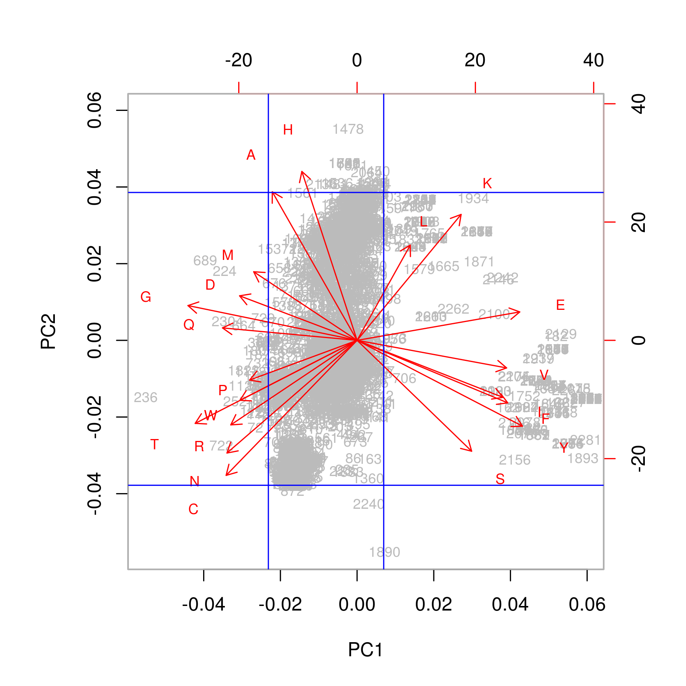

# Principle Component Analysis of `c_m_TRANSFORMED.csv`

## Introduction

This chapter describes the use and functional understanding of Principle Component Analysis (PCA) on the `c_m_TRANSFORMED.csv` of the Myoglobin/control dataset. PCA is very popular and commonly used during the EDA phase to provide information on the proportions of variance found within a dataset. 

>The major goal of principal components analysis is to reveal hidden structure in a dataset. In so doing, we may be able to[^31]
>
>1. identify how different variables work together to create the dynamics of the system  
>2. reduce the dimensionality of the data  
>3. decrease redundancy in the data  
>4. filter some of the noise in the data  
>5. compress the data  
>6. prepare the data for further analysis using other techniques  

[^31]:Principal Components Analysis:A How-To Manual for R, Emily Mankin, http://people.tamu.edu/~alawing/materials/ESSM689/pca.pdf

## Finding the Covariance Matrix

Covariance provides a measure of the strength of the correlation between two or more sets of random variates.[^32] 

[^32]:http://mathworld.wolfram.com/Covariance.html

#### Covariance of two variables {-}
$$cov(X, Y) ~=~ \frac{1}{N} \sum_{i=1}^N (x_i - \bar x) (y_i - \bar y)$$

#### Covariance of matrices[^33] {-}

[^33]:Trevor Hastie, Robert Tibshirani, Jerome Friedman, 'The Elements of Statistical Learning; Data Mining, Inference, and Prediction', Second Edition, 2009, Springer, DOI:10.1007/978-0-387-84858-7

Determining the covariance using matrix, $\large M$ using linear algebra notation is;[^34]

[^34]:http://mathworld.wolfram.com/Covariance.html

1. Find the column means of the matrix, $M_{means}$.
2. Find the difference matrix, $D ~=~ M - M_{means}$.
3. Finally calculate the covariance matrix:

$$cov ~ (M) ~=~ \frac{1}{N-1} ~ D^T ~ D, ~~~ where ~~~ D = M - M_{means}$$

PCA is similar to the singular value decomposition (SVD) used when determining eigenvectors and eigenvalues.

>Singular value decomposition says that every n x p matrix can be written as the product of three matrices: $A = U \Sigma V^T$ where:[^35]
>
>1. $U$ is an orthogonal n x n matrix.
>2. $\Sigma$ is a diagonal n x p matrix. In practice, the diagonal elements are ordered so that $\Sigma_{ii} ~\geqq~ \Sigma_{jj}$ for all i < j.
>3. $V$ is an orthogonal p x p matrix and $V^T$ represents a matrix transpose.
>
>The SVD represents the essential geometry of a linear transformation. It tells us that every linear transformation is a composition of three fundamental actions. Reading the equation from right to left:
>
>1. The matrix $V$ represents a rotation or reflection of vectors in the p-dimensional domain.
>2. The matrix $\Sigma$ represents a linear dilation or contraction along each of the p coordinate directions. If n ≠ p, this step also canonically embeds (or projects) the p-dimensional domain into (or onto) the n-dimensional range.
>3. The matrix $U$ represents a rotation or reflection of vectors in the n-dimensional range.

[^35]:https://blogs.sas.com/content/iml/2017/08/28/singular-value-decomposition-svd-sas.html

The intuition for understanding PCA is fairly straightforward. Consider the 2-dimensional data cloud of points or observations in an hypothetical experiment, as seen in the figure on the left. Considering this data, the variances along both the x and y dimensions can be calculated. However, given the data shown, there is a rotation of that x-y plane which will present the data showing its greatest variance. This variance will reside on an axis analogous to points on an Ordinary Least Squares (OLS) line. This axis is called the *first principle component* followed by the second principal component and so on. 

Unlike an OLS calculation, PCA will determine not only the first and largest variance of your data set but it will through the rotation and transform your dataset via linear algebra, calculating N variances within you dataset, where N is equal to the number of features in the dataset. The second principle component will be calculated only along a coordinate axis which is perpendicular (orthogonal or orthonormal) to the first. Each subsequent principle component will then be calculated along axises which are orthogonal to each other. A further benefit of using PCA is that the variances it reports will be ranked in order from highest to lowest.[^36]

[^36]:Brian Everitt, Torsten Hothorn, An Introduction to Applied Multivariate Analysis with R, 2011, Springer, DOI:10.1007/978-1-4419-9650-3

* For more information on Eigenvalues, Eigenvectors and Eigen decomposition I suggest
    + [CodeEmporium](https://youtu.be/9oSkUej63yk)
    + [Victor Lavrenko](https://youtu.be/IbE0tbjy6JQ)

```{r message=FALSE, warning=FALSE, include=FALSE}
## Initialize libraries
Libraries <- c("knitr", "ggfortify")

for (p in Libraries){
    library(p, character.only = TRUE)
}
opts_chunk$set(cache = TRUE, warning = FALSE, message = FALSE)
```

### Example of two-dimensional PCA using random data: {-}
```{r echo=FALSE}
set.seed(1000)
x = seq(1, 4, 0.05)
y = 1.5*x + rnorm(61, mean = 0, sd = 0.5)
rb_palette <- colorRampPalette(c("red","blue"))
z <- rb_palette(10)[as.numeric(cut(y,breaks = 10))]

xy_pca <- prcomp(cbind(x, y),
                 scale = T)

par(mfrow = c(1,2))
plot(x, y, 
     ylim = c(-0.5,8), 
     xlim = c(-0.5,4.5), 
     main = "Raw Data", 
     pch = 20, 
     col = z)
abline(0, 1.5, col = "red")
plot(xy_pca$x[, 1], xy_pca$x[, 2], 
     main = "Rotated Data: 56.3 Degrees", 
     xlab = "PC1", 
     ylab = "PC2", 
     pch = 20, 
     col = z, 
     ylim = c(-1, 1))
abline(h = 0, col = "red")
```

Questions:  
1. What information can be gleaned from PCA?   
2. What do the center and scale arguments do in the `prcomp` command?  

There are many R-packages which will carry out the steps for PCA all behind the 'scenes' but giving no greater understanding for beginners. For example, `stats::prcomp` [^38], `stats::princomp` [^39] are most commonly used. However, there are *several dozen* similar packages. A key word search for *PCA* at R-cran[^37] provides 78 matches, as of November, 2019.

[^37]:https://cran.r-project.org/web/packages/available_packages_by_name.html  
[^38]:https://stat.ethz.ch/R-manual/R-devel/library/stats/html/prcomp.html  
[^39]:https://stat.ethz.ch/R-manual/R-devel/library/stats/html/princomp.html  

## Data centering / scaling / normalization

While determining the variance of your dataset it should be clear that the order of magnitude of your data features matters greatly. The reasons for this should be clear that if one axis is in 1,000's while the second axis is between 1 and 10, the larger scale will obviously have a greater variance distorting the results.

There are four common methods for scaling data:

Scaling Method | Formula
---------------|--------------
Centering | $f(x) ~=~ \large x - \bar x$
Scaling between [0, 1] | $f(x) ~=~ \Large \frac {x - min(x)} {max(x) - min(x)}$
Scaling between [a, b] | $f(x) ~=~ \large (b - a)* \Large \frac {x - min(x)} {max(x) - min(x)} + a$
Normalizing | $f(x) ~=~ \Large \frac {x - mean(x)} {\sigma_x}$

```{r include=FALSE}
## Import data & data handling
c_m_transformed  <- read.csv("../00-data/02-aac_dpc_values/c_m_TRANSFORMED.csv")
c_m_20aa <- c_m_transformed[, -c(1:3)] # Raw data - Keeping only 20 AA columns

centered_c_m_20aa <- data.frame(apply(c_m_20aa, 2, function(x) x - mean(x))) # Scaled data
norm_c_m_20aa <- data.frame(apply(c_m_20aa, 2, function(x) ((x - mean(x)) / sd(x)))) # Normalized  data
```

## Histograms of Scaled Vs Unscaled data

Investigating the differences between the amino acid Phenylalanine (F) before and after 2 scaling methods.  
```{r echo=FALSE, fig.align = "center"}
par(mfrow = c(1,3))
hist(c_m_20aa$F,
     main = "Unscaled Data",
     ylim = c(0, 1400),
     breaks = 10,
     xlim = c(-0.1, 0.8))

hist(centered_c_m_20aa$F,
     main = "Centered Data",
     ylim = c(0, 1400),
     breaks = 10,
     xlim = c(-0.3, 0.5))

hist(norm_c_m_20aa$F,
     main = "Normalized Data",
     ylim = c(0, 1400),
     breaks = 10,
     xlim = c(-5, 7))
```

Investigating the plots above, the main idea to recognize is that the data has not been fundamentally changed, simply 'shifted and stretched' or more accurately transformed. In fact, any visible changes of the distributions can be accounted for by differing binnings.

## Principle component analysis using `norm_c_m_20aa`
```{r, cache = TRUE}
start_time <- Sys.time() # Start timer

c_m_20_PCA = prcomp(norm_c_m_20aa)

end_time <- Sys.time()   # End timer
end_time - start_time    # Display time
```

## Screeplot: Eigenvalues Vs Principal Components
```{r echo=FALSE, fig.align = "center"}
screeplot(c_m_20_PCA,
          main = "Screeplot of c_m_20_PCA",
          sub = "PC(i)\n(Red Line Indicates Kaiser Rule, Eigenvalues = 1)",
          npcs = 20,
          type = "lines",
          ylim = c(0, 7))
abline(h = 1, col = "red")
abline(v = 5, col = "green")
```

## Plot: Cumulative Proportion of Variance Vs Principal Components
```{r echo=FALSE, fig.align = "center"}
plot(cumsum(c_m_20_PCA$sdev^2 / sum(c_m_20_PCA$sdev^2)), 
     main = "Cumulative Proportion of Variance Vs Principle Component",
     sub = "(Red line indicates p = 0.9, Green line indicates PC = 12)",
     ylab = "% Variance(i) / Total Variance",
     xlab = "PC(i)",
     ylim = c(0,1),
     type = "b")
abline(h = 0.9, col = "red")
abline(v = 12, col = "green")
```

## Biplots

### Biplot 1: PC1 Vs PC2 with 'Class' by color labels

- Black indicates control protein set, Class = 0

- Blue indicates myoglobin protein set, Class = 1
```{r echo=FALSE, fig.align="center", fig.height=6, fig.width=6}
autoplot(c_m_20_PCA, 
         data = c_m_transformed,
         label.show.legend = F,
         colour = "Class", 
         shape = FALSE,
         label = TRUE,
         label.size = 4,
         loadings = TRUE, loadings.label = TRUE, loadings.label.size = 7,
         loadings.label.hjust = 2)
```

```{r include=FALSE, fig.align = "center"}
## Print Biplot1.annotated.png
## Biplot 1 for Conclusion discussion
png(filename = "Biplot1.annotated.png",
    width = 6, 
    height = 6, 
    units = "in", 
    res = 300)
autoplot(c_m_20_PCA, 
         data = c_m_transformed,
         label.show.legend = F,
         colour = "Class", 
         shape = FALSE,
         label = TRUE,
         label.size = 4,
         loadings = TRUE, 
         loadings.label = TRUE, 
         loadings.label.size = 7,
         loadings.label.hjust = 2)
dev.off()
```

### Biplots 2: Determination Of 4 Rule Set For Outliers

```{r echo=FALSE, fig.height=6, fig.width=6, fig.align = "center"}
plot(x = c_m_20_PCA$x[, 1], 
     y = c_m_20_PCA$x[, 2],
     main = "Boundary (Outlier) Determination of PC1 Vs PC2",
     xlab = "PC2",
     ylab = "PC1",
     cex = 0.5)
     # col = c("#bbbbbb", "#ff0000"),
     # cols <- c(1,2))
abline(v =  3, col = "blue", lw = 1)
abline(v = -3, col = "blue", lw = 1)
abline(h = -3, col = "blue", lw = 1)
abline(h =  3, col = "blue", lw = 1)
```

```{r include=FALSE}
## Print 'Biplot.2pc1.pc2.png'
## Biplot 2 for Conclusion discussion
png(filename = "Biplot.2pc1.pc2.png", 
    width = 6,
    height = 6,
    units = "in",
    res = 300)
biplot(c_m_20_PCA,
       cex = 0.75,
       col = c("#bbbbbb", "#ff0000"),
       cols <- c(1, 2))
abline(v = 4.5, col = "blue", lw = 1)
abline(v = -15, col = "blue", lw = 1)
abline(h = 25, col = "blue", lw = 1)
abline(h = -24.5, col = "blue", lw = 1)
dev.off()
```

## Obtain Outliers From Biplot #2: PC1 Vs PC2

#### Number of Outliers from Principal Component-1 (PC-1) {-}

Rule Set Given PC1:  

1. Outlier_1: c_m_20_PCA$x[, 1] > 3 std dev

2. Outlier_2: c_m_20_PCA$x[, 1] < -3 std dev
```{r}
outliers_PC1 <- which((c_m_20_PCA$x[, 1] > 3) | (c_m_20_PCA$x[, 1] < -3))
length(outliers_PC1)
```

#### Number of Outliers from PC-2 {-}

Rule Set Given PC1: 

3. Outlier_3: c_m_20_PCA$x[, 2] > 3 std dev

4. Outlier_4: c_m_20_PCA$x[, 2] < -3 std dev
```{r}
outliers_PC2 <- which((c_m_20_PCA$x[, 2] > 3) | (c_m_20_PCA$x[, 2] < -3))
length(outliers_PC2)
```

### List of all outliers (union and sorted) found using rule set 1 through 4

- The list of total outliers is derived by taking the `union` of `outliers_PC1` and `outliers_PC2` and then using `sort`.

```{r echo=FALSE}
total_pca_1_2_outliers <- union(outliers_PC1, outliers_PC2)
total_pca_1_2_outliers <- sort(total_pca_1_2_outliers)

length(total_pca_1_2_outliers)

# Write out to Outliers folder
write.table(total_pca_1_2_outliers, 
            file = "../00-data/false_positive_outliers/pca_1_2_outliers.csv", 
            row.names = FALSE, 
            na = "", 
            col.names = TRUE, 
            sep = ",")
```

It is important to remember and understand that this list of "total_pca_1_2_outliers" includes BOTH negative and positive controls. The groupings are as follows:

Group | Range of Groups
------|----------------
Controls | 1, ..., 1217
Positive (Myoglobin) | 1218, ..., 2341

## Conclusions

Principal Component Analysis is an excellent choice to include during Exploratory Data Analysis.

### Screeplot

There are two plots which are commonly used to determine the number of principal components that a researcher would generally accept as useful. The eigenvalues derived from PCA are proportional to the variances which they represent, and depending on the strategy used to calculate them, the eigenvalues are equal to the variances of the components. 

The first of the two plots which I which is the scree plot.[^310] The scree plot is an ranked list of the eigenvalues plotted against its own principal components. An eigenvalue score of one is thought to provide a comparable amount of information as a single variable un-transformed by PCA.[^FIND]

[^310]:Cattell, Raymond (1966). "The scree test for the number of factors". Multivariate Behavioral Research. 1 (2): 245–76. doi:10.1207/s15327906mbr0102_10

The second plot describes the cumulative proportion of variance versus the principle component. This graphic shows how much each principal component describes from the entire cumulative variances or total squared error. 

$$Cumlative ~ Proportion ~of ~Variance ~=~ \frac{\sigma_i^2}{\sum_{i=1}^N \sigma_i^2}$$

Here again there are several criteria regarding how best to use the information from the is plot.  The first of which is Cattell's heuristic. Cattell advises to use the principal component that is above the elbow of the curve. The second heuristic is keeping the total number of factors that best explains 80%-95% of the variance.  There is no hard fast rule at this time, a set of researchers only use the first three factors or none at all.[^311] A second suggestion is to use the Kaiser rule, which states it is sufficient to use Prncipal Components which have a eigenvalue greater than or equal to one.[^312]

[^311]:Nicole Radzill, Ph.D., personal communication.
[^312]:https://stats.stackexchange.com/questions/253535/the-advantages-and-disadvantages-of-using-kaiser-rule-to-select-the-number-of-pr

If we investigate the 'cumulative proportion of variance' plot we see an arbitrary line on the Y-axis which denotes the 90% mark. At this point the plot suggests that a researcher could use largest 12 of the variances from the PCA.  

### Biplots

I have chosen for the sake of brevity to analyze the PCA biplot of the first and second principal components. 

```{r echo=FALSE, out.width="60%", fig.align = "center"}

```

#### Biplot 1: PC1 Vs PC2 with color 'Class' labels {-}

- Black indicates control protein set, Class = 0  
- Blue indicates myoglobin protein set, Class = 1  
