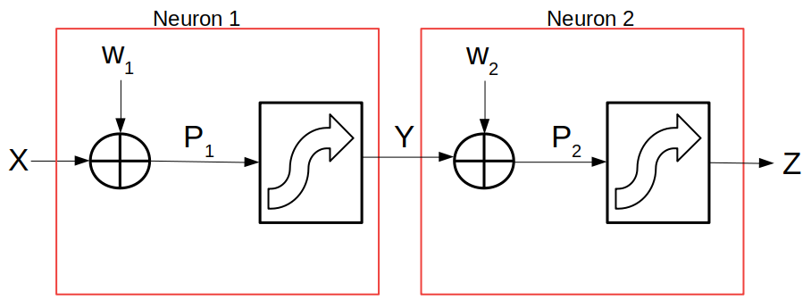

# Neural Networks For Binary Classification

```{r 51, message=FALSE, warning=FALSE, include=FALSE}
# Load Libraries
library("knitr")
```

>"Machine learning is essentially a form of applied statistics with increased emphasis on the use of computers to statistically estimate complicated functions and a decreased emphasis on proving confidence intervals around these functions"
>
> -- Ian Goodfellow, et al[^51]

[^51]:Ian Goodfellow, Yoshua Bengio, Aaron Courville, 'Deep Learning', MIT Press, 2016, http://www.deeplearningbook.org

## Introduction

If we discuss Neural Networks (NN), we should first consider the system we hope to emulate. Let us start with a simple count of neuronal cells in various organisms along the earth's phylogenetic tree. We might get a better idea of the type of "computing power" these living creatures possess. See table 6.1.

#### Table 6.1: Organisms Vs Number of Neurons In Each ([Wikipedia](https://en.wikipedia.org/wiki/List_of_animals_by_number_of_neurons)) {-}

| Organism               | Common Name | Approximate Number of Neurons |
| :--------------------- | ----------: | ----------------------------: |
| C. elegans             |   roundworm |                           302 |
| Chrysaora fuscescens   |   jellyfish |                         5,600 |
| Apis linnaeus          |   honey bee |                       960,000 |
| Mus musculus           |       mouse |                    71,000,000 |
| Felis silvestris       |         cat |                   760,000,000 |
| Canis lupus familiaris |         dog |                 2,300,000,000 |
| Homo sapien sapien     |      humans |               100,000,000,000 |

This table portrays a high-level overview of the computing power of neuronal clusters and brains produced throughout evolution. However, there is one missing number worth noting. The table above does not describe the connectivity between neurons. The connectivity of neurons varies greatly from lower to higher organisms. For example, some simple animals, such as the roundworm, have only "four to eight separate branches," [^52] per nerve cell. While human neurons may have greater than 10,000 inter-connected synaptic junctions per neuron, thus resulting in a total of approximately 600 trillion synapses per human brain.[^53]

[^52]:https://www.wormatlas.org/hermaphrodite/nervous/Neuroframeset.html

[^53]:Shepherd, G. M. (2004), The synaptic organization of the brain (5th ed.), Oxford University Press, New York.

Although neurons have differing morphologies, neurons in the human brain are extremely diverse. Indeed, size and shape may not be the definitive way of classifying neurons but instead by what neurotransmitters the cells secrete. "Neurotransmitters can be classified as either excitatory or inhibitory." [^58] Currently the [NeuroPep](http://isyslab.info/NeuroPep/home.jsp) database "holds 5949 non-redundant neuropeptide entries originating from 493 organisms belonging to 65 neuropeptide families." [^59]


[^58]:https://www.kenhub.com/en/library/anatomy/neurotransmitters

[^59]:http://isyslab.info/NeuroPep/home.jsp


[^54]

[^54]:https://www.howstuffworks.com/


Given an order of operation via:

*Dendrite(s) $\Longrightarrow$ Cell body $\Longrightarrow$ Fibrous Axon $\Longrightarrow$ Synaptic Junction or Synaptic Gap $\Longrightarrow$ Dendrite(s) ... Ad infinitum.*

However, nature is more subtle and intricate than to have neurons in a series, only blinking on and off, firing or not. NN are often programmed to classify dangerous road objects, as is the case of Tesla cars. The goal of a Tesla auto-piloted car is to use all available sensors to correctly classify all the conceivable circumstances on the road. On the road, a Tesla automobile uses dozens of senors which the computer needs to evaluate and weigh the values of all these sensors to formulate a 'decision.' The altitude of the auto, derived from the GPS, may weigh less heavily than the speed of the vehicle or Lidar estimates on how close objects are. However, our goal of safe driving can be thwarted when an artificial intelligence system decides a truck is a sign and does not apply the brakes.[^55]


[^55]:https://arstechnica.com/cars/2019/05/feds-autopilot-was-active-during-deadly-march-tesla-crash/

### The One Neuron System

If we investigate a one neuron system, *our* neuron could be diagrammed in four sections.[^56]


[^56]:Tom Mitchell, Machine Learning, McGraw-Hill, 1997, ISBN: 0070428077

If we investigate one neuron for a moment, we find two separate mathematical functions are being carried out by a single nerve cell.

#### Summation Function

The first segment is a summation function. It receives the real number values from, $x_1$ to $x_n$, all the branches of the dendritic trees, and multiplies them by a set of weights. These $X$ inputs are multiplied by a set of corresponding unique weights from $w_1$ to $w_n$. An analogy I prefer is of small or large rivers joining giving a total current. The current moves through the branches giving a total signal or current of sodium ions. Interestingly the summation in each neuron, while dealing with the vectors of inputs and weights, is carrying out the [dot product](https://www.khanacademy.org/math/linear-algebra/vectors-and-spaces/dot-cross-products/v/vector-dot-product-and-vector-length) of these vectors.

Initially, the NN researchers used the Heaviside-Threshold Function, as shown in figure 5.4, *One Neuron System*. The benefits of step functions were their simplicity and high signal to noise ratio. While the detriments were, it is a discontinuous function, therefore not differentiable and a mathematical problem.

Let us take into account the product, $x_0 \cdot w_0$. If we assign $x_0 = T$ and $w_0 = -1$ this simply becomes a bias. This bias allows us the ability to shift our Activation Function and its inflection point in the positive or negative x-direction.

\begin{equation} 
\large \hat Y ~=~ X^T \cdot W - Bias ~~\equiv~~ \sum_{i=0}^n x_i w_i - T
\end{equation}

#### Activation Functions

The second function is called an Activation Function. Once the Summation Function yields a value, its result is sent to the *Activation Function* or *Threshold Function*.

\begin{equation} 
\large {Z}^{(1)} = f \left( \sum_{i=0}^n x_i w_i - T\right) = \{0, 1\}
\end{equation}

The function displayed in figure #6.4, One Neuron Schema, is a step function. However this step function has a problem mathematically, namely it is a discontinuous and therefore not differentiable. This fact is important.

Therefore several functions may be used in place of the step function. One is the hyperbolic tangent (*tanh*) function, the *sigmoidal* function, a *Hard Tanh*, a *reLU*, and *Softmax* Functions. These have certain advantages, namely they simplify the hyperbolic tangent function. Not only does the Hard Tanh and reLU simplify calculations it is useful for increasing the gain near the asymptotic limits of the sigmoidal and tanh functions. The derivatives of the sigmoidal and tanh functions are very small, near 0 and 1, while the reLU and Hard Tanh slopes are one or zero.

\begin{equation} 
\large Z^{(2)} ~=~ tanh(x) = \frac{1 - e^{-{\alpha}}}{1 + e^{-{\alpha}}} ~~~:~~~ \large where ~~~ \large \alpha = \sum_{i=1}^n x_i w_i - T
\end{equation}

\begin{equation} 
\large Z^{(3)} ~=~ sigmoid(x) ~=~ \frac{1}{1 + e^{-{\alpha}}}
\end{equation}

\begin{equation} 
\large Z^{(4)} ~=~ Hard ~ Tanh (x) ~=~ \large \left\{ \begin{array}{rcl} 1 &  x > 1 \\ x & -1 \leq x \leq 1 \\ -1 & x < -1 \end{array}\right.
\end{equation}

```{r 56, fig.height=4, echo=FALSE, fig.align = "center"}
x = seq(-4, 4, 0.02)
par(mfrow=c(1, 3))
y_tanh = tanh(x)
y_sigmoid = 1/(1 + exp(-x))
# Plot - Tanh
plot(x, y_tanh,
     type = "l",
     main = "Hyperbolic Tangent",
     ylab = "tanh(x)")
abline(h = 0, v = 0, col = "#F24F4F")
# Plot 2 - Logistic
plot(x, y_sigmoid,
     type = "l",
     ylim = c(-1,1),
     main = "Logistic / Sigmoidal",
     ylab = "sigmoid(x)")
abline(h = 0, v = 0, col = "#F24F4F")
# Plot 3 - Hard Tanh
x_prime = c(-1, 1)
y_prime = c(-1, 1)
plot(x_prime, y_prime,
     xlim = c(-4, 4),
     ylim = c(-1, 1),
     main = "Hard Tanh",
     ylab = "f(x)")
segments(-1, -1, 1, 1)
segments(-1, -1, -4, -1)
segments(1, 1, 4, 1)
abline(h = 0, v = 0, col = "#F24F4F")
```

Several alternative functions are useful for various reasons. The most common of which are Softmax and reLU functions.

Rectified Linear Activation Unit, (ReLU): 

\begin{equation} 
\large Z^{(5)} ~=~ \large ReLU ~= \begin{cases} x \geq 0 ~~~~y = x\\ x < 0 ~~~~y = 0 \end{cases}
\end{equation}

#### Binary Output Or Probability

In the case of real neurons, the output is off or on, zero or one. However, in the case of our electronic model, it is advantageous to calculate a probability for greater interpretability.

>The Softmax function may appear like the Sigmoid function from above but it differs in major ways.[^57]
>
>* The softmax activation function returns the probability distribution over mutually exclusive output classes.
>* The calculated probabilities will be in the range of 0 to 1.
>* The sum of all the probabilities is equals to 1.

[^57]:Josh Patterson, Adam Gibson, Deep Learning; A Practitioner’s Approach, 2017, O'Rreilly

Typically the Softmax Function is used in binary or multiple classification logistic regression models and in building the final output layer of NN.

\begin{equation} 
\large Z^{(6)} ~=~ Softmax(x) = \frac {e^{\alpha_i}}{\sum_{i=1}^n e^{\alpha_i}}
\end{equation}

```{r 57, echo=FALSE, fig.height=4.5, fig.align="center"}
x = seq(-4, 4, 0.02)
  
par(mfrow=c(1,2))

plot(x=0, y=0,
     xlim = c(-4, 4),
     ylim = c(-1,1),
     main = "ReLU Profile",
     xlab = "x",
     ylab = "ReLU(x)")
abline(h = 0, v = 0, col = "#F24F4F")
segments(-4, 0, 0, 0)
arrows(0,0,1,1)
plot(x, y_sigmoid,
     type = "l",
     ylim = c(-1,1),
     main = "Softmax Profile",
     ylab = "Softmax(x)")
abline(h = 0, v = 0, col = "#F24F4F")
```

The benefit of these activation functions is that they are now differentiable. This fact becomes important for *Back-Propagation*, which is discussed later.


### The Two Neuron System

Building up in complexity, let us could consider our first Neural Network by using *only* two neurons. In two neuron systems, let us first generalize a bit more by adding that $X$ is an array of all the inputs as is $W_1$ and $W_2$ is also an array of weights for each neuron. See figure #6.5.



#### Feed-Forward In A Two Neuron Network

In our two neuron network, we can now write out the mathematics for each step as it progresses in a "forward" (left to right) direction.

Step #1: To move from $X$ to $P_1$
\begin{equation} 
  f^1( \overrightarrow{x}, \overrightarrow{w}) \equiv~~ P_1 = \left( X^T \cdot W_1 - T \right)
\end{equation}

Step #2: $P_1$ feeds forward to $Y$ 
\begin{equation} 
  f^2(P_1)  ~~\equiv~ \hat Y = \left( \frac{1}{1 + e^{- \alpha}} \right) ~~:~~ where ~~~ \alpha = P_1
\end{equation}

Step #3: $Y$ feeds forward to $P_2$ 
\begin{equation}
  f^3(\overrightarrow{y}, \overrightarrow{w}) ~~\equiv~ P_2 = \left( Y^T \cdot W_2 - T \right)
\end{equation}

Step #4: $P_2$ feeds forward to $Z$ 
\begin{equation}
  f^4(P_2) ~~\equiv~ \hat Z = \left( \frac{1}{1 + e^{- \large \alpha}} \right) ~~~:~~~ where ~~ \alpha = P_2
\end{equation}

Step #5: Our complicated function is simply a matter of chaining one result so that it may be used in the next step.

\begin{equation}
   \hat Z ~=~ f^4 \left( f^3 \left( f^2 \left( f^1 \left( X, W \right) \right) \right) \right)
\end{equation}

In our **Feed-Forward Propagation**, we can now take the values from any numerical system and produce zeros, ones, or probabilities. Remember, in this set of experiments, we are using the concentrations of the 20 amino acids to provide a categorical or binary output, belongs to a) Myoglobin protein family, or b) does not.

#### Error Back-propagation

Now that we have learned to calculate the output of our neurons using the Feed-Forward process, what if our final answer is incorrect? Can we build a feed back system to determine the weights needed to obtain our desired value of $\hat z$? The short answer is yes. The process for determining the weights is known as Error Back-Propagation. Error Back-Propagation, also known as Back-Propagation, is crucial to understanding and tuning a neural network.

Simply stated Back-Propagation is an optimization routine which iteratively calculates the errors that occur at each stage of a neural network. Starting from randomly seeded values for the initial weights, Back-Propagation uses the partial derivatives of the feed forward functions. The chain rule and gradient descent are also used to determine the weights ($W_1 ~~and~~ W_2$) which are propagated through the network to find weights used in the summation step of a neuron.[^510]

[^510]:David Rumelhart, Geoffrey Hinton, & Ronald Williams, Learning Representations By Back-Propagating Errors, Nature, 323, 533-536, Oct. 9, 1986

This thumbnail sketch gives the building blocks to calculate $W$ which can be run until we reach a value that we desire. However the first time the back-propagation is carried out all the weights are chosen randomly. If the weights were set to the same number there would be no change throughout the system.

In the two neuron system, our first step is to generate an error or performance (Perf) function to minimize. If we call $d$ our desired value, we can minimize the square error, a common choice.[^511]

[^511]:Ivan N. da Silva, Danilo H. Spatti, Rogerio A. Flauzino, Luisa H. B. Liboni, Silas F. dos Reis Alves, Artificial Neural Networks: A Practical Course, DOI 10.1007/978-3-319-43162-8, 2017

Step #1: Performance (Perf)
\begin{equation}
\mathbf{Perf} ~~=~~ c \cdot (d - \hat z)^2
\end{equation}

Step #2: 
\begin{equation}
\frac{d Z}{d x} ~~=~~ \frac{d \left \{ f^4 \left( f^3 \left( f^2 \left( f^1 \left( X, W \right) \right) \right) \right) \right \}}{dx}
\end{equation}

---


Using the chain-rule, and figure 6.6, *Two Neuron System* as a guide, we can backwards to derive the formulas for error back-propagation. We find:

Step #3: Neuron 2 $\Rightarrow$ 1
\begin{equation}
  \frac{\delta Perf}{\delta w_1} ~=~ \frac{\delta Perf}{\delta z} \cdot \frac{\delta z}{\delta P_2} \cdot \frac{\delta P_2}{\delta y} \cdot \frac{\delta y}{\delta P_1} \cdot \frac{\delta P_2}{\delta w_1}
\end{equation}

Step #4: Performance
\begin{equation}
  \frac{\delta Perf}{\delta z} ~~=~~ \frac{\delta \left\{ \frac{1}{2} \| \overrightarrow{d} - \overrightarrow{z} \|^2 \right\}} {\delta z} ~~=~~ d - z
\end{equation}

Step #5: Substitute $P_2=\alpha$
\begin{equation}
\frac{\delta z}{\delta P_2} ~~=~~ \frac{\delta~ ((1 + e^{-\alpha})^{-1})}{\delta \alpha} ~~=~~ e^{-\alpha} \cdot (1 + e^{-\alpha})^{-2}
\end{equation}

Step #6: Rearrange the right expression
\begin{equation}
  \frac{ e^{-\alpha} }{ (1 + e^{-\alpha})^{-2} } ~~=~~ \frac{e^{-\alpha}}{1 + e^{-\alpha}} \cdot \frac{1}{1 + e^{-\alpha}}
\end{equation}

Step #7: Add 1 *and* subtract 1
\begin{equation}
  = ~~ \frac{ (1+ e^{-\alpha}) -1 }{1 + e^{-\alpha}} \cdot \frac{1}{1 + e^{-\alpha}}
\end{equation}

Step #8: Rearrange to find
\begin{equation}
 = ~~ \left( \frac{ 1+ e^{-\alpha} }{1 + e^{-\alpha}} ~-~ \frac{ 1 }{1 + e^{-\alpha}} \right)  \left( \frac{1}{1 + e^{-\alpha}} \right) ~~=~~ \left(1- \frac{1}{1 + e^{-\alpha}} \right) \left( \frac{1}{1 + e^{-\alpha}} \right)
\end{equation}

Step #9: Therefore we find
\begin{equation}
\frac{\delta z}{\delta \alpha} ~~=~~ \frac{\delta~ ((1 + e^{-\alpha})^{-1})}{\delta \alpha} ~~=~~ \left(1- \frac{1}{1 + e^{-\alpha}} \right) \left( \frac{1}{1 + e^{-\alpha}} \right)
\end{equation}

Nevertheless, we need one more part to ascertain the weights. As the error back-propagation is computed this process does not reveal how much the weights need to be adjusted/changed to compute the next round of weights given their current errors. For this we require one last equation or concept.

Once we compute the weights from our chain rule set of equations we must change the values in the direction proportional to the change in error. This is performed by using gradient descent. 

Step #10: Learning Rate
\begin{equation}
\Delta W ~:~ W_{i+1} ~=~ W_i ~-~ \eta \cdot \frac{\delta Perf}{\delta W}
\end{equation}

where $\eta$ is the learning rate for the system. The key to the learning rate is that it must be sought and its range mapped for optimum efficiency. However smaller rates have the advantage of not overshooting the desired minimum/maximum. If the learning rate is too large the values of $W$ may jump wildly and not settle into a max/min.  There is a fine balance that must be considered such that the weights are not trapped in a local minimum and wildly oscillate unable to converge.

The last step of *error back-propagation* is simply setting up the derivatives mechanically and is not shown for brevity.


## Neural Network Conclusion

The Neural Network set included a total of 79 unique observations containing both FP and FN.

Accuracy was the primary criteria used to select the optimal model. There were 20 models tested. The neural network was configured with 20 inputs (one for each amino acid), one hidden layer and one output. The hidden layer was tested with either 10, 12, 14, 16, 18, 20 neurons and a array of different decays (1, 0.1, 0.01, 0.001). The caret software has a tuning parameter named `tuneGrid` that allows users to `expand` a set of arrays to a matrix of combinations to be tested. Therefore 20 models were tested with the training data set and the best values were size = 20 and decay = 0.1.

At this time, the author is not aware of any heuristic that gives the proper number of hidden layers and the proper number of neurons in each layer therefore one must search the experimental space for an optimized configuration. If a more thorough search of the experiemntal space was carried out using two or three hidden layers would be investigated. The poor showing of the Neural Network suggests that the data may have some additional decision boundary that is not yet represented by only 20 neurons.  


