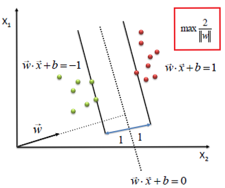

---
output:
    pdf_document: default
    #html_document: default
---

# Support Vector Machines for Binary Classification

>"Support Vector Machines should be in the tool bag of every civilized person."
>
> -- Patrick Winston [^61]

[^61]:Patrick Winston, 6.034 Artificial Intelligence, Fall 2010, Massachusetts Institute of Technology: MIT OpenCourseWare, http://ocw.mit.edu/6-034F10

## Introduction

Support Vector Machine (SVM) learning is a supervised learning technique that may be used as a binary classification system or to find a regression formula. Support vector machines are a “maximum margin classifier. SVM finds the separating hyperplane with the maximum margin to its closest data points.” [^62]

[^62]:Nika Haghtalab & Thorsten Joachims, CS4780/5780 - Machine Learning for Intelligent Systems, Fall 2019, Cornell University, Department of Computer Science, https://www.cs.cornell.edu/courses/cs4780/2018fa/lectures/lecturenote09.html

Although there are many mathematical approaches to solving SVM, many of which include kernels, let us first describe the Linear SVM used for binary classification. Consider a situation where we need to distinguish between two circumstances, or classes.

In an imaginary biochemistry laboratory, researchers discover a novel enzyme found in different tissues throughout the human body. Biochemists purify the enzyme from several cadavers and several different tissue types. Literature suggests that this newly found enzyme has two isozymes, 1) Alpha has a high reaction rate and 2) Gamma has a lower reaction rate. It now seems like a simple task to learn which isozymes you possess. Carry out kinetic enzyme analysis on the purified samples then attempt to classify them.

Once you have carried out the kinetic analysis you then determine the Michaelis–Menten constant, $K_M$. The $K_M$ constant is plotted on a single axis and produces the graphic below.

```{r echo=FALSE}
# Load Libraries
Libraries <- c("knitr", "graphics", "e1071")
for (p in Libraries) { 
    library(p, character.only = TRUE)
}
opts_chunk$set(cache = TRUE, fig.align = "center")
```


```{r echo=FALSE, out.width='50%', fig.cap = 'Is this linearly separable data?'}
set.seed(1000)
x1 = rnorm(20, mean = 1.5, sd = 0.5)
x1_max = max(x1)
x2 = rnorm(20, mean = 4, sd = 0.5)
x2_min = min(x2)
midpt = (x2_min - x1_max)/2 + x1_max
y = rep(1, 20)

stripchart(x = x1,
           main = "Test #1; Enzyme Rates, Km",
           xlab = "Km (rate of consumption per unit time)",
           xlim = c(0, 6),
           pch = 16,
           col = "green")
points(x = x2, y, col = "blue")
abline(v = x1_max, col = "red", lwd = 3)
abline(v = midpt, col = "black", lwd = 3, lty = 2)
abline(v = x2_min, col = "red", lwd = 3)
```

## Linearly Separable

In test #1, we can see the two isozymes can easily separated by activity alone. Figure #1 demonstrates that the data is *linearly separable.* The dataset is linearly separable if a single straight line can partition the data.  In more general terms, "if the classes are linearly separable, it can be shown that the algorithm converges to a separating hyperplane." [^63] As Cortes and Vapnik indicate the hyperplane is the decision boundary of any high dimension feature space, considering a hyperplane has one less dimension than its n-dimensional space.

[^63]:Trevor Hastie, Robert Tibshirani, Jerome Friedman, The Elements of Statistical Learning; Data Mining, Inference, and Prediction, https://web.stanford.edu/~hastie/ElemStatLearn/, 2017

Incidentally, in Patrick Winston's lecture on SVM, he calls SVM the "widest street approach."[^64] Why does Professor Winston use this term? There are many possible streets which can be traced but the *goal* is to find the *widest street*. Many streets may be drawn in our example, but requiring the *widest street* leads to one. In fact, "an optimal hyperplane is here defined as the linear decision function with maximal margin between the vectors of the two classes."[^65]

[^64]:Patrick Winston, 6.034 Artificial Intelligence, Fall 2010, Massachusetts Institute of Technology: MIT OpenCourseWare, http://ocw.mit.edu/6-034F10

[^65]:C. Cortes, V. Vapnik, Machine Learning, 20, 273-297, 1995

```{r echo=FALSE, fig.align="center", out.width="85%"}

```

Adding the prosaic phrase *widest street* smartly leads to the idea that a widest decision boundary also has the greatest ability to generalize.   

## Bias-Variance Trade-Off

The ability to generalize is a key idea in predictive modeling. This idea harkens back to freshman classes where one studied Student's t-test and analysis of variance.

$$E \left[ \left( y_0 - \hat f(x_0) \right )^2 \right ] = Var ( \hat f(x_0)) + \left [Bias (\hat f(x_0)) \right]^2 + Var(\epsilon)$$
[^66]

[^66]:Trevor Hastie, Robert Tibshirani, Jerome Friedman, The Elements of Statistical Learning; Data Mining, Inference, and Prediction, https://web.stanford.edu/~hastie/ElemStatLearn/, 2017

The bias-variance dilemma can be stated as follows.

- Models with too few parameters are inaccurate because of a large bias: they lack flexibility.

- Models with too many parameters are inaccurate because of a large variance: they are too sensitive to the sample details (changes in the details will produce huge variations).

- Identifying the best model requires controlling the “model complexity”, i.e., the proper architecture and number of parameters, to reach an appropriate compromise between bias and variance.

```{r echo=FALSE, fig.align="center", out.width="70%"}
include_graphics("../00-data/10-images/p-values_schematic.jpg")
```

[^67]

[^67]:Allison Horst, University of California, Santa Barbara, https://github.com/allisonhorst/stats-illustrations

However in real life, linearly separabale data is rarely the case. Most often the activities are mixed as shown in test #2.

```{r echo=FALSE, fig.height=3}
set.seed(1000)
x1 = rnorm(20, mean = 1.9, sd = 0.5)
x2 = rnorm(20, mean = 3.25, sd = 0.75)
y = rep(1,20)

stripchart(x = x1,
     main = "Test #2: Km of Enzymes",
     xlab = "Km",
     xlim = c(0, 6),
     pch = 16,
     col = "green")
points(x = x2, y, col = "blue")
abline(v = x1_max, col = "red", lwd = 3)
abline(v = midpt, col = "black", lty = 2, lwd = 3)
abline(v = x2_min, col = "red", lwd = 3)
```

## Understanding the hyperplane equation

```{r echo=FALSE, fig.align="center", out.width="55%"}

```
[^618]

[^618]:Trevor Hastie, Robert Tibshirani, Jerome Friedman, The Elements of Statistical Learning; Data Mining, Inference, and Prediction, https://web.stanford.edu/~hastie/ElemStatLearn/, 2017

If we were trying to find:

$$\frac{1}{2} \widehat W (X_{\oplus} ~-~ X_{\ominus})$$

Where $\widehat W ~=~ \left ( \frac{x_1}{||x||}, ~ \frac{x_2}{||x||} \right )$

Where $X_{\oplus}$ and $X_{\ominus}$ represent data points that are labeled either positive or negative 

Suppose that $X_{\oplus}$ and $X_{\ominus}$ are equidistant from the decision boundary:

Where $a$ represents the region above the hyperplane;

$$W^T X_{\oplus} + b = a$$

and where $-a$ represents the region below the hyperplane or decision boundary.

$$W^T X_{\ominus} + b = -a$$

Subtracting the two equations:

$$W^T (X_{\oplus} ~-~ X_{\ominus}) = 2a$$

Divide by the norm of w:

$$\widehat W^T (X_{\oplus} ~-~ X_{\ominus}) = \frac{2a}{||W||}$$

[^619]

[^619]:????

### insert pic of 2a divided by a hyperplane.


## Soft Margins

In the case above, the activities overlap hence determining which isozyme is Alpha or Gamma is more difficult. In 1995, C. Cortes and V. Vapnik introduced the mathematics and ideas for "Soft Margins" or non-separable training data.[^68] 

[^68]:C.Cortes, V.Vapnik, Machine Learning, 20, 273-297, 1995

The same is true of an n-dimensional system.

```{r echo=FALSE}
set.seed(1000)

x <- c(rnorm(10, mean = 4, sd = 0.1), rnorm(10, mean = 2, sd = 0.1))
y <- c(rnorm(10, mean = 4, sd = 0.1), rnorm(10, mean = 2, sd = 0.1))
z <- c(rep( 1, 10), rep(-1, 10))
data_svm <- data.frame("x" = x, "y" = y, "z" = as.factor(z))
 
svm_model_1 <- svm(z ~ .,
                   data = data_svm,
                   kernel = "linear",
                   cost = 10,
                   scale = FALSE)

plot(svm_model_1,
     data = data_svm)
```

The first mention of an SVM like system is by Vapnik and Lerner in 1963, where the two described an implementation of a non-linear generalization called a Generalized Portrait algorithm.[^69] As research has progressed, the types and complexity of SVM implementations have grown to encompass many circumstances. The ability of SVM to deal with different problems and handle different decision boundary shapes has made SVM a potent tool.

[^69]:V. Vapnik and A. Lerner, 1963. Pattern recognition using generalized portrait method. Automation and Remote Control, 24, 774–780

For example, this experiment has chosen to investigate three possible decision boundary shapes for the two-class protein data. The three mathematical constructs which will be tested are:

1. Linear hyperplane (also known as "plain-vanilla"),
2. Curvilinear or polynomial hyperplane and,
3. A radial basis function hyperplane,
4. Sigmoidal.

### Linear: $K(x, ~y) ~=~ w^T x + b$ 

- The linear kernel does not transform the data at all. 

Three common SVM kernel formulae investigated are:

### Polynomial: $K(x_i, ~y) ~=~ ( \gamma ~x_i^T ~x_j ~+~ r)^{\Large d}, ~~ \gamma > 0$ 

- The polynomial kernel has a straightforward non-linear transform of the data. 
- Such that $~\gamma, ~r$, and $d$ are kernel parameters. 

### Radial Basis Function (RBF): $K(x_i, x_j) ~=~ exp ( - {\gamma} \parallel x_i^T - x_j \parallel ^2 ), ~~ \gamma >0$

- The Gaussian RBF kernel which performs well on many data and is a good default

### Sigmoidal: $K(x, y) ~=~ {\tanh} (\gamma~ x^T ~ y ~+~ r ), ~~ \gamma >0$

- Incidentally, The sigmoid kernel produces an SVM analogous to the activation function similar to a [perceptron] with a sigmoid activation function.[^610]

[^610]:(https://data-flair.training/blogs/svm-kernel-functions/)

**It is essential to note**, at this time, there are no reliable rules for which kernel, i.e., boundary shape, to use with any given data set.

Plots of 4 common SVM boundary shapes: 
```{r echo=FALSE}
xi <- seq(-5, 5, 0.1)
yi <- seq(-5, 5, 0.1)
par(mfrow = c(1, 4))

plot(x = xi, y = 0.2 * yi,
xlim = c(-5, 5),
ylim = c(-1, 1),
type = "l",
col = "blue",
main = "Linear Case",
ylab = "y", xlab = "x")

plot(x = xi, y = 0.05*xi^2,
xlim = c(-5, 5),
ylim = c(-1, 1),
type = "l",
col = "blue",
main = "Polynomial, d=2",
ylab = "y", xlab = "x")

plot(x = xi, y = exp(-0.4*xi^2),
xlim = c(-5, 5),
ylim = c(-1, 1),
type = "l",
col = "blue",
main = "RBF Case",
ylab = "y", xlab = "x")

plot(x = xi, y = tanh(xi),
xlim = c(-5, 5),
ylim = c(-1, 1),
type = "l",
col = "blue",
main = "Tanh Case",
ylab = "y", xlab = "x")
```

### SVM-Linear

The simplest form of SVM utilizes a hyperplane as a separating element between the positive and control protein observations. This type of implementation is denoted as SVM-Linear (svm-lin) in this report. Here the mathematics is more easily described and can even be shown with a simple 2-dimensional graphic.

```{r echo=FALSE, fig.align="center", out.width="65%"}

```
[^611]

[^611]:Vapnik

Given a set of labeled pairs of data:

$$\{(X_1, ~y),~ ...,~ (X_m, ~y)\},~~~ y \in \{1, ~-1\}, ~~~ where ~X^{m~x~n} \in \Re$$ 

For mathematical convenience, the labels are a set of values 1 or -1.

Therefore, we may write. 

$$~~~f(x_i) = \left\{ \begin{array}{cc} \geq 0; ~y = 1 \\ ~< 0; ~y = -1 \end{array} \right.$$

This is no different than is currently done in beginner level algebra. As is shown in the example below, the same is true for higher-dimensional problems.

```{r echo=FALSE, fig.align="center", out.width="45%"}

```

[^612]

[^612]:Vapnik

Will be described and calculated in more detail in this report. However, there are alternative implementations of SVM. 

In this experiment, three implementations of SVM have been used. The three are denoted as SVM-Linear (svm-lin), SVM-Polynomial (svm-poly), and SVM-Radial Basis Function (svm-rbf). 

The switches in the R/caret software are easy such that one can use a number of kernels by changing the name of method..

with differing amounts of hyperparameters to modify. The intuition for the svm-poly and svm-rbf is also fairly straightforward. Instead of using a linear hyperplane to bisect the hi-dimensional space, which describes the decision boundary, the mathematics for a polynomial curvilinear function or a radial basis function may be utilized. 

Yet another measurable difference that was investigated in this experiment was the use of a kernel transformation. It is conceivable to envision a hyperplane with no transformations utilized. Alternatively, the kernel transformations of original data can be used to increase the ability of the function to differentiate between positively and negatively labeled samples. A mathematical treatment can be found by Christopher Burges.[^613]

[^613]:Christopher Burges, Tutorial on Support Vector Machines for Pattern Recognition, D.M. & Knowl. Dis., 2, 121-167, 1998

As the usage of SVM grew, different issues presented problems for defining and coding the decision boundary were found. In the simplest case, the data points that sit along the support vector are nicely and neatly on the positive or the negative side. This is known as a hard margin which delineates the decision boundary. In reality, the decision boundary may include positive or negative datapoints that sporadically cross the boundary. In the circumstance where the decision boundary has similar points on either side, a penalty may be enlisted to deter the mathematics from choosing a boundary that includes too many misfit datapoints. In 1995, Support Vector Machines were described by Vladimir Vapnik and Corinna Cortes while at Bell Labs dealt with the soft-margin that occurs in the above situation.[^614]

[^614]:Vladimir Vapnik & Corinna Cortes, Machine Learning, 20, 273-297, 1995

```{r echo=FALSE, fig.align="center", out.width="65%"}
include_graphics("../00-data/10-images/soft.margin.svm.png")
```

SVM is a non-parametric approach to regression and classification models. 

What is Non-parametric? 

For that matter, what is parametric learning and models. Just as we have learned that machine learning models can be supervised, unsupervised, or even semi-supervised another characteristic between machine learning models is whether they are parametric or not.

In Webster's dictionary [^615] states a *parameter* is

>a. Estimation of values which enter into the equation representing the chosen relation
>
>b. [An] independent variable through functions of which other functions may be expressed - Frank Yates, a 20th-century statistician

[^615]:Webster's third new international dictionary, ISBN 0-87779-201-1, 1986

Another excellent explanation of this idea includes;

>Does the model have a fixed number of parameters, or does the number of parameters grow with the amount of training data? The former is called a parametric model, and the latter is called a non-parametric model. Parametric models have the advantage of often being faster to use, but the disadvantage of making stronger assumptions about the nature of the data distributions. Non-parametric models are more flexible, but often computationally intractable for large datasets.[^616]

[^616]:Kevin P. Murphy, Machine Learning, A Probabilistic Perspective, MIT Press, ISBN 978-0-262-01802-9, 2012

Since Support Vector Machines are best described as a system where increasing the amount of training data, the numbers of parameters may grow as well. Therefore SVM is a non-parametric technique. Considering this idea in more detail, the estimation of the decision boundary does not entirely rely on the estimation of independent values (i.e., the values of the parameters). SVM is fascinating because the decision boundary may only rely on a small number of data points, otherwise known as support vectors. 

In short, one guiding idea of SVM is a geometric one. In a binary-class learning system, the metric for the concept of the "best" classification function can be realized geometrically[^617] by using a line or a plane (more precisely called a hyperplane when discussing multi-dimensional datasets) to separate the two labeled groups. The hyperplane that separates the labeled sets is also known as a decision boundary. 

[^617]:Xindong Wu, et al., Top 10 algorithms in data mining, Knowl Inf Syst, 14:1–37, DOI:10.1007/s10115-007-0114-2, 2008

This decision boundary can be described as having a hard or soft margin. As one might suspect, there are instances where the delineation between the labels is pronounced when this occurs decision boundary produces a hard margin. Alternatively, when the demarcation between the labeled groups is not so well defined by a straight and rigid line, the decision boundary provided is a soft margin. In either case, researchers have built up mathematics to deal with hard and soft margins. As an aside, the use of penalization is one method for coping with data points that impinge on the boundary hyperplane.


Patrick Winston calls it the 'widest street approach'.
- See: [Patrick Winston](https://www.youtube.com/watch?v=_PwhiWxHK8o)

By introducing a "soft margin" instead of a hard boundary, we can add a slack variable xi to account for the amount of a violation by the classifier, which later can be minimized.


In short, one guiding idea of SVM is a geometric one. In a binary-class learning system, the metric for the concept of the "best" classification function can be realized geometrically[^620] by using a line or a plane (more precisely called a hyperplane when discussing multi-dimensional datasets) to separate the two labeled groups. The hyperplane that separates the labeled sets is also known as a decision boundary. 

[^620]:X

Incidentally, 

Big O notation [^621]

|   Algorithm  |     Training     |  Prediction   |
| :----------: | :--------------: | :-----------: |
| SVM (Kernel) | O$(n^2 p + n^3)$ |  O$(n_s v_p)$ |

Where *p* is the number of features, *n_s v_p* is the number of support vectors

[^621]:X

The history of SVMs Large margin linear classifiers
Vapnik, V., and A. Lerner. Pattern recognition using generalized portrait method. Automation and Remote Control, 24, 774–780, 1963. 

Large margin non-linear classifiers B. Boser, I. Guyon, and V. Vapnik. A training algorithm for optimal margin classifiers. In the Fifth Annual Workshop on Computational Learning Theory, pages 144—152, 1992 

SVMs for non-separable data C. Cortes and V. N. Vapnik, Support vector networks. Machine Learning, vol. 20, no. 3, pp. 273-29


SVM {caret} / https://rpubs.com/PranovMishra/476455

- Tuning parameter C = cost for optimized model
- grid = expand.grid(C = seq(0.5, 10, 0.5)) USE: 2^-10 to 2^15 ????? SEE PAPER

for rbf:
- Create grid control: sigma, C
- tune.Grid = data.frame(expand.grid(sigma = seq(1, 10, 1)),
- C = seq(1, 10, 1))


There are three properties that make SVMs attractive for data scientists:[^622]

[^622]:Stuart Russell and Peter Norvig, Artificial Intelligence, A Modern Approach, Third Edition, Pearson, ISBN-13: 978-0-13-604259-4, 2010

>1. SVMs construct a maximum margin separator. They retain training examples and potentially need to store them all. On the other hand, in practice, they often end up employing only a small fraction of the number of examples 25.
>2. FIND # 2 AND 3 FOR WRITE UP.
>3.
