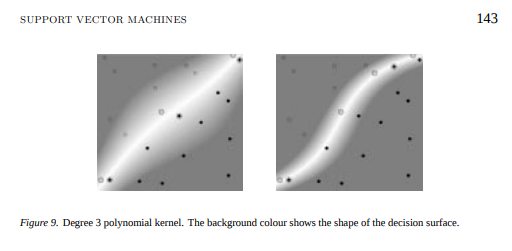

# Conclusion

```{r message=FALSE, warning=FALSE, include=FALSE}
knitr::opts_chunk$set(cache=TRUE)
```

# Biplot1.annotated.png

This research was carried out to investigate if there is any relationship between the unsupervised machine learning technique of Principal Component Analysis and five alternate methods.  The five alternative methods included 3 Support Vector Machines, a Neural Network and Logistic Regression. 

The comparison between PCA and the five alternate M.L. methods was done be using only the first two Principal Components, since these two comprise approximately 50% of the error of total sum of squares error. See table 8.1. 

Table 8.1, The Six M.L Algorithms consist of:

| Name                             |         Type |    Output Used For Graphing |
| :------------------------------- | -----------: | :-------------------------: |
| Principal Component Analysis     | Unsupervised | Anomalies > Abs($3 \sigma$) |
| Logistic Regression              |   Supervised |                     FP & FN |
| SVM-linear                       |   Supervised |                     FP & FN |
| SVM-polynomial kernel            |   Supervised |                     FP & FN |
| SVM-radial basis function kernel |   Supervised |                     FP & FN |
| Neural Network w 20 Neurons      |   Supervised |                     FP & FN |

## Comparison of PCA Anomalies 

of this study was that there would be a correlation or overlap of the anomalies which occurred 

Statistical Learning Method Vs Total Number of FP/FN

| Statistical Method                  | Unique |
| :---------------------------------- | -----: |
| Principal Component Analysis        |    460 |
| Logit                               |    119 |
| SVM Linear                          |    125 |
| SVM Polynomial                      |     70 |
| SVM Radial Basis Function           |     58 |
| Deep Learning                       |     79 |


## Comparison of Accuracy Measurements

Mean Accuracies of M.L. Techniques, n=10

| Rank |  M.L. Technique | Mean Accuracy |
| :--: | --------------: | ------------: |
|  1   |         SVM-RBF |     0.9510603 |
|  2   |        SVM-Poly |     0.9415091 |
|  3   |         SVM-Lin |     0.9292275 |
|  4   | NN w 20 Neurons |     0.9286350 |
|  5   |           Logit |     0.9078127 |


One main tenet of fitting any model to a set of number is that it is helpful and even important to know about the distribution(s) of the number set(s). However without fore knowledge about the distribution(s) modeling may be difficult.  Therefore the basic assumption throughout this exercise is that we are teaching models without knowing the probability distributions. Also, using several different machine learning approaches is advantageous.

To help us with the task of fitting unknown distributions must use cost or error functions to minimize problems with fitting a model. In many cases in the research the cost function is a summation of square errors. However it is a fine line between over-fitting and under-fitting or model to our data set. To achieve a best fit the model must be flexible.  There is a trade off, between reducing the variance and a commensurate increase of bias. 

>There are many ways to define such models, but the most important distinction is this: does the model have a fixed number of parameters, or does the number of parameters grow with the amount of training data? The former is called a parametric model, and the latter is called a non-parametric model. Parametric models have the advantage of often being faster to use, but the disadvantage of making stronger assumptions about the nature of the data distributions. Non-parametric models are more flexible, but often computationally intractable for large data sets.
>
>Kevin Murphy[^81]

[^81]:Kevin P.Murphy, Machine learning : a probabilistic perspective, 2012, ISBN 978-0-262-01802-9

We have seen that it is helpful to transform the raw data for several reasons. The first example was during the Exploratory Data Analysis chapter that found skewness was found in three of the amino acid columns or features. The skewness of these three features was greater than 2.0. Using common techniques such as taking the square-root or taking the reciprocal or log transformations are common and easy to achieve.

Alternatively, transformations such as the kernel transformation is used strategically with Support Vector Machines.  Of the three examples of SVM, the SVM-Linear did not use a kernel transformation and its performance while being good compared to the Logistic Regression had accuracy less than the SVM which used Kernel transformations.  It is possible to use any number of transformations such as the polynomial and the radial-basis function.  These alternatives allow non-linear decision boundaries. 


[^82]

[^82]:Kevin P.Murphy, Machine learning : a probabilistic perspective, 2012, ISBN 978-0-262-01802-9

A Neural Network was set up and experimented with the protein data set.  The NN was set to explore a small set of the total possible experimental space. The number of neurons was tested between 10 and 20 with an interval of 2.  It was surprising to see that the NN was fourth out of five in accuracy. It is surprising due to the idea that two neurons should be somewhat equivalent to a decision boundary with 20 linear boundaries. However only one hidden layer was attempted.  In the future more attention would have been paid to Restricted Boltzmann Machines or other types of neurons which employ memory or types of feed-back.

One additional strategy for building M.L. models is to use an Ensemble approach.  Ensembles are very easy to implement.  For example, a model consisting of a Logistic Regression followed by SVM model could be paired in the hope that it would achieve higher accuracies. This researcher also is aware of several other M.L. methods that could be very useful with data that is between a finite range such as the percent amino acid composition. The percent amino acid composition is by definition between 0 and 1. Also, this protein data set has a rather small set of predictors or independent variables.

The impetus for this work was a paper published in 2007 by Xindong Wu, J. Ross Quinlan, et al.[^83]  I found this paper to be an amazing starting point since it ranked most common M.L. techniques. I chose my M.L. methods with this paper in mind. Starting with the Logistic Regression as the entry point for understanding Neural Networks and even other binary classifiers. One area that was not discussed here is Decision Trees and CART. These use Entropy and Information theory as the ideas governing there behaviour. In depth review of these M.L. approaches woould havve been an excellent background for Random Forests and all of its spin-offs.

[^83]:Xindong Wu, J. Ross Quinlan, et al., Knowl Inf Syst (2008) 14:1–37, DOI 10.1007/s10115-007-0114-2

One item which was interesting was that the Principal Component Analysis had very little bearing on the set of observations that were found as false-positives and false-negatives. This could be due to the fact that the first two principal components which were chosen have very little bearing on how the alternative M.L. methods produce their decision boundaries. It was an interesting experiment nonetheless, since it is thought that PCA can reduce dimensional.  The fact that 12 of the principal components were needed to achieve 90-95% variance in the system.  It was hoped that the 50% which was represented by the first two components would be functional. This could also suggest that the decision boundary that best fits the protein data set is not linear. 


