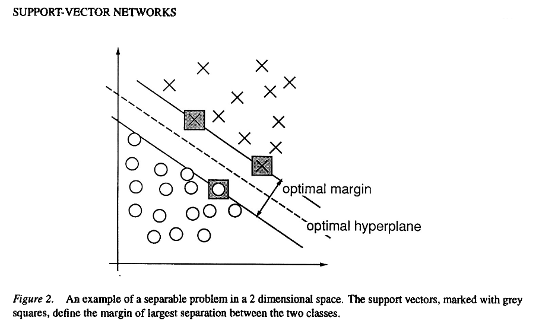

# SVMs NOTES: Four plots 

Support vector machine (SVM) learning is a very popular technique. It is a supervised learning technique which may be used as a classification system or to find regression formula. Support Vector Machines were described by Vladimir Vapnik and Corinna Cortes in 1995 while at Bell Labs.[^61]

[^61]:V. Vapnik and C. Cortes, Machine Learning, 20, 273-297 (1995)

In the case of this work, the SVM inputs consist of a set of a labeled pair of data, $(X, Y)$.

Where

$X \in R^{\large m \times n}$, matrix $X$ has $m$ rows and $n$ columns  

The set of labeled training patterns,  

$\{(x_1, y_1),~ ...,~ (x_m, y_m)\},~~~ y_i \in \{1, -1\}~~~$ or we may write $~~~f(x_i) = \left\{ \begin{array}{cc} \geq 0; ~y_i = 1 \\ ~< 0; ~y_i = -1 \end{array} \right\}$

There are three properties that make SVMs attractive for data scientists:[^62]

[^62]:[Artificial Intelligence, A Modern Approach, Third Edition, Stuart Russell and Peter Norvig, 2010, Pearson, ISBN-13: 978-0-13-604259-4]

>1. SVMs construct a maximum margin separator — a decision boundary with the largest possible distance to example points. This helps them generalize well.

Patrick Winston has a more interesting title for the maximum margin separator. He uses the term "widest street approach",[^63] which can be seen below. One goal of SVMs is to position the street in such a way to make it the widest possible. The center of the street then becomes the decision boundary which delineates between the group of X's and the group of O's. Although this decision boundary may be easy to visualize in one, two, or even three dimensions when a large hyperspace is used this makes interpretation difficult or impossible.

[^63]:https://www.youtube.com/watch?v=_PwhiWxHK8o

```{r echo=FALSE}

```

[^64]

[^64]:V. Vapnik and C. Cortes, Machine Learning, 20, 273-297 (1995)

2. SVMs create a linear separating hyperplane, but they have the ability to embed the data into a higher-dimensional space, using the so-called kernel trick. Often, data that are not linearly separable in the original input space are easily separable in the higher-dimensional space. The high-dimensional linear separator is actually nonlinear in the original space. This means the hypothesis space is greatly expanded over methods that use strictly linear representations.

3. SVMs are a nonparametric method—they retain training examples and potentially need to store them all. On the other hand, in practice they often end up retaining only a small fraction of the number of examples—sometimes as few as a small constant times the number of dimensions. Thus SVMs combine the advantages of nonparametric and parametric models: they have the flexibility to represent complex functions, but they are resistant to overfitting.

https://www.youtube.com/watch?v=_PwhiWxHK8o&t=64s

The aim of this method is to identify a hyperplane which separates the samples. The technique can be used for both classification and numerical prediction. It is traditionally applied for binary classification. Benefits include high scalability, but drawbacks, as for neural nets, include models which are very difficult to interpret. SEE: https://rpubs.com/mzc/mlwr_svm_concrete

Support Vector Machines are Supervised tools.

IMPORTANT: Cortes, C. & Vapnik, V. (1995).  Support-vector network.Machine Learning,20, 1–25.

Therefore, given a set of labeled pairs of data: 

$(x_i, y_i),~~ i = 1, ..., l~~$   where  $~~x_i \in R^n~~$ and $~~y \in \{1, -1\}^l$    

Such that $~f(x_i) = \left\{ \begin{array}{cc} \geq 0; ~y_i = 1 \\ ~< 0; ~y_i = -1 \end{array} \right\}$

where $~~y~~$ is a set of two values which indicate a label, e.g. true or false.

min $\frac{1} {2} W^{T} W ~~+~~ C ~ \sum_{i=1}^l \xi_i$

subject to $~~y_i (w^T \phi (x_i) ~+~ b) \geq (1 - \xi_i)$  where $~\xi_i \geq 0$, 

$C$ is the penalty parameter, *cost*, of the error term, such that $C > 0$.

Furthermore, $K(x_i, x_j) ~~\equiv~~ \phi (x_i)^T \phi (x_j)$ is called the kernel function.

The 4 most common SVM formulae are:

1. Linear: $K(x_i, ~y_j) ~~=~~ <x, ~y>$   
    - The linear kernel does not transform the data at all.  

2. Polynomial: $K(x_i, x_j) ~~=~~ ( \gamma ~x_i^T ~x_j ~~+~~ r)^{d}, ~\gamma > 0$  
    - The polynomial kernel has a simple non-linear transform of the data.  

3. Radial Basis Function (RBF):  $K(x_i, x_j) ~~=~~ exp ( - \gamma \parallel x_i^T - x_j \parallel ^2 ), ~\gamma >0$  
    - The Gaussian RBF kernel which performs well on many data and is a good default 

4. Sigmoid: $K(x_i, x_j) ~~=~~ \tanh ( \gamma~ x_i^T ~ x_j ~~+~~ r ), ~\gamma >0$  
    - The sigmoid kernel produces a SVM analogous to the activation function similar to a [perceptron](https://cs.stanford.edu/people/eroberts/courses/soco/projects/neural-networks/Neuron/index.html) with a sigmoid activation function.[^1]
    
[^1]:https://rpubs.com/mzc/mlwr_svm_concrete
        
- Such that $~\gamma, ~r~$ and $~d~$ are kernel parameters.  

There are no reliable rules for which kernel to use with any given data set.  

Plots for 4 most common SVM formulae:  
```{r echo=FALSE}
xi = seq(-5, 5, 0.1) 
yi = seq(-5, 5, 0.1) 
par(mfrow=c(1,4)) 

plot(x=xi, y=0.2*yi, 
     xlim = c(-5,5), 
     ylim = c(-1,1), 
     type="l", 
     col="blue", 
     main = "Linear Case", 
     ylab="y", xlab="x")

plot(x=xi, y=xi^2,
     xlim = c(-5,5),
     ylim = c(-1,1),
     type = "l",
     col="blue",
     main = "Polynomial Case, d=2",
     ylab="y", xlab="x")

plot(x=xi, y=exp(-1*xi^2),
     xlim = c(-5,5),
     ylim = c(-1,1),
     type = "l",
     col="blue",
     main = "RBF Case",
     ylab="y", xlab="x")

plot(x=xi, y=tanh(xi),
     xlim = c(-5,5),
     ylim = c(-1,1),
     type = "l",
     col="blue",
     main = "Tanh Case",
     ylab="y", xlab="x")
```

